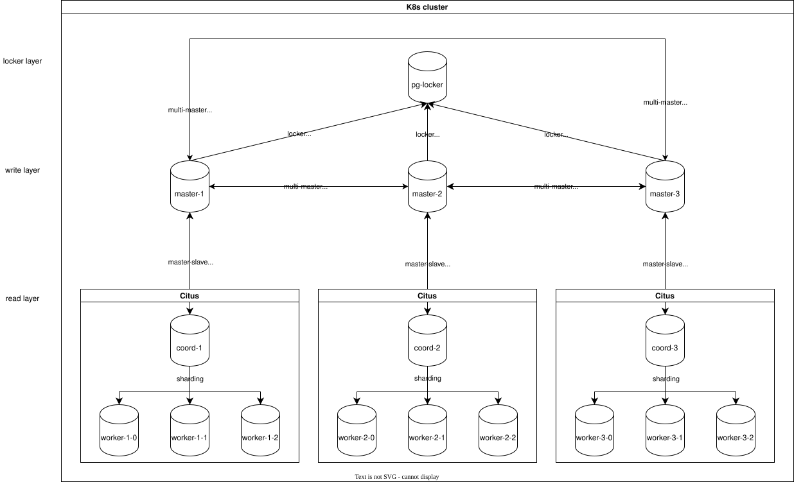

# Citus PostgreSQL Cluster

## Стек

| Компонент     | Образ                | Роль                                       |
| ------------- | -------------------- | ------------------------------------------ |
| master-x      | postgres:18.3        | Хранит данные, публикует WAL               |
| coordinator-x | citusdata/citus:13.0 | Управляет шардами, подписывается на master |
| worker-x-y    | citusdata/citus:13.0 | Хранит шарды                               |
| pg-locker     | postgres:18.3        | Глобальные блокировки                      |

## Архитектура



## Структура Helm чарта

```

citus-chart/
├── Chart.yaml
├── values.yaml
└── templates/
    ├── namespace.yaml        # namespace: citus
    ├── storage.yaml          # StorageClass для каждого компонента
    ├── masters.yaml          # StatefulSet + Service для master-1/2/3
    ├── coordinators.yaml     # StatefulSet + Service для coordinator-1/2/3
    ├── workers.yaml          # StatefulSet + headless Service для workers
    └── locker.yaml           # StatefulSet + Service для pg-locker
```

## values.yaml — ключевые параметры

```yaml
image:
citus: citusdata/citus:13.0
postgres: postgres:18.3

postgres:
config:
walLevel: logical # обязательно для репликации
maxReplicationSlots: 10
maxWalSenders: 10
maxLogicalReplicationWorkers: 10
maxWorkerProcesses: 20

masters:
mountPath: /var/lib/postgresql # postgres 18+ требует без /data

coordinators:
mountPath: /var/lib/postgresql/18/docker

workers:
mountPath: /var/lib/postgresql
replicas: 3 # worker-x-0, worker-x-1, worker-x-2

```

## Логическая репликация

### master -> master (мультимастер)

Каждый master публикует свою таблицу и подписывается на остальных.
origin = none — ключевой параметр: данные которые уже пришли через репликацию
не реплицируются повторно. Это предотвращает бесконечные петли в мультимастере.

```sql
-- на master-1
create publication master1_pub_app for table app_users;

create subscription master1_sub_from_master2
connection 'host=master-2.citus.svc.cluster.local port=5432 ...'
publication master2_pub_app
with (origin = none, copy_data = false);

### master -> coordinator

create subscription coord1_sub_from_master1
connection 'host=master-1.citus.svc.cluster.local port=5432 ...'
publication master1_pub_app
with (copy_data = false);
```

## Шардирование через триггер

Citus не поддерживает logical replication напрямую в distributed table.
Решение — промежуточная таблица + триггер:

```sql
app_users (обычная) ──BEFORE trigger──> app_users_distributed (32 шарда)
^
logical replication от master
```

Почему BEFORE + ENABLE ALWAYS:

- BEFORE триггер срабатывает при репликации (в отличие от AFTER)
- ENABLE ALWAYS — триггер работает и при обычном INSERT и при replication worker
- ENABLE REPLICA — только при репликации (недостаточно)
- public. prefix в триггере — replication worker запускается без search_path

```sql
-- правильная настройка триггера
begin;
set local citus.enable_ddl_propagation to off;
alter table app_users enable always trigger trg_sync;
commit;

citus.enable_ddl_propagation = off нужен чтобы ALTER TABLE не распространился на воркеры.

-- Триггер:

create or replace function sync_to_distributed()
returns trigger language plpgsql as $$
begin
    if tg_op = 'INSERT' then
        insert into public.app_users_distributed (id, name, balance)
        values (new.id, new.name, new.balance)
        on conflict (id) do update
            set name    = excluded.name,
                balance = excluded.balance;
        return new;
    elsif tg_op = 'UPDATE' then
        update public.app_users_distributed
        set name    = new.name,
            balance = new.balance
        where id = old.id;
        return new;
    elsif tg_op = 'DELETE' then
        delete from public.app_users_distributed
        where id = old.id;
        return old;
    end if;
end;
$$;

create trigger trg_sync
before insert or update or delete on app_users
for each row execute function sync_to_distributed();
```

## Шардирование

```sql
select citus_set_coordinator_host('coordinator-1', 5432);

select master_add_node('worker-1-0.worker-1-headless.citus.svc.cluster.local', 5432);
select master_add_node('worker-1-1.worker-1-headless.citus.svc.cluster.local', 5432);
select master_add_node('worker-1-2.worker-1-headless.citus.svc.cluster.local', 5432);

set citus.shard_count = 32;
set citus.shard_replication_factor = 1;

select create_distributed_table('app_users_distributed', 'id');
```

Воркеры доступны по DNS через headless service:
worker-1-0.worker-1-headless.citus.svc.cluster.local

## pg-locker

Отдельный PostgreSQL для глобальных блокировок. Вызывается через dblink:

```sql
perform locker_call_try_lock('app_users', key_text);
perform locker_call_release_lock('app_users', key_text);
```

Адрес: pg-locker.citus.svc.cluster.local

## Команды

```bash
# Deploy
kubectl create namespace citus
helm upgrade --install citus . -n citus

# Пересоздать полностью
helm uninstall citus -n citus
kubectl delete pvc --all -n citus
kubectl delete pv --all
helm upgrade --install citus . -n citus

# Статус
kubectl get pods -n citus
kubectl get svc -n citus

# Port-forward
kubectl port-forward -n citus svc/coordinator-1 15431:5432
kubectl port-forward -n citus svc/coordinator-2 15432:5432
kubectl port-forward -n citus svc/coordinator-3 15433:5432
kubectl port-forward -n citus svc/master-1      15421:5432
kubectl port-forward -n citus svc/master-2      15422:5432
kubectl port-forward -n citus svc/master-3      15423:5432
kubectl port-forward -n citus svc/pg-locker     15440:5432

# Workers (headless — только через pod)
kubectl port-forward -n citus pod/worker-1-0 15411:5432
kubectl port-forward -n citus pod/worker-1-1 15412:5432
kubectl port-forward -n citus pod/worker-1-2 15413:5432

# Подключение psql
psql -h localhost -p 15431 -U postgres  # coordinator-1
psql -h localhost -p 15432 -U postgres  # coordinator-2
psql -h localhost -p 15433 -U postgres  # coordinator-3
psql -h localhost -p 15421 -U postgres  # master-1
psql -h localhost -p 15422 -U postgres  # master-2
psql -h localhost -p 15423 -U postgres  # master-3
psql -h localhost -p 15440 -U postgres  # pg-locker

# Логи
kubectl logs -n citus coordinator-1-0
kubectl logs -n citus master-1-0

# Рестарт
kubectl rollout restart statefulset/coordinator-1 -n citus
kubectl rollout restart statefulset/coordinator-2 -n citus
kubectl rollout restart statefulset/coordinator-3 -n citus
kubectl rollout restart statefulset/master-1 -n citus
kubectl rollout restart statefulset/master-2 -n citus
kubectl rollout restart statefulset/master-3 -n citus
kubectl rollout restart statefulset/worker-1 -n citus
kubectl rollout restart statefulset/worker-2 -n citus
kubectl rollout restart statefulset/worker-3 -n citus
kubectl rollout restart statefulset/pg-locker -n citus
```

## Проверка после запуска

```sql
-- воркеры зарегистрированы
select * from master_get_active_worker_nodes();

-- шарды созданы
select * from pg_dist_shard;
select * from pg_dist_partition;

-- репликация активна
select * from pg_stat_subscription;
select * from pg_subscription_rel;  -- srsubstate = 'r' означает ready

-- данные в шардах
select count(*) from app_users;
select count(*) from app_users_distributed;
```

## Порядок инициализации

1. Запустить кластер: helm upgrade --install citus . -n citus
2. Выполнить master-1.sql, master-2.sql, master-3.sql
3. Выполнить coord-1.sql, coord-2.sql, coord-3.sql
4. Проверить репликацию и шарды через запросы выше
